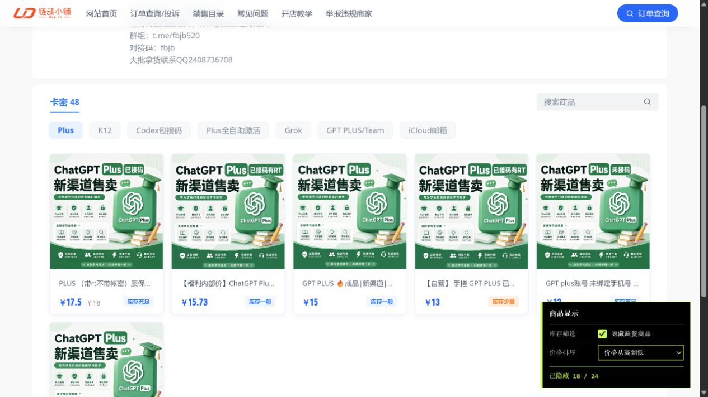
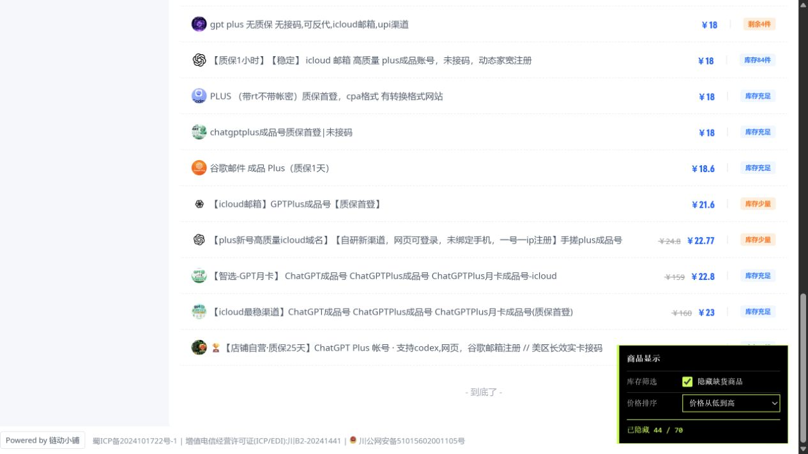

# 链动小铺增强工具

一个用于链动小铺店铺页和购买页的油猴脚本。页面右下角的统一控制面板可以筛选缺货商品、按价格排序、保存联系方式和安全密码，并在购买页或店铺页的订单确认弹窗中自动填写已保存的信息。

## 功能

- 在页面内动态切换显示或隐藏缺货商品
- 支持默认顺序、价格从低到高、价格从高到低三种排序
- 在购买页及店铺页的订单确认弹窗中自动填写已保存的联系方式和安全密码
- 四项设置均可跨页面、跨刷新记忆，无需反复输入或调整
- 购买信息可随时修改或从油猴本地存储中清除
- 实时显示当前隐藏数量和商品总数
- 自动识别 `.stock.rank0` 或状态文字为“缺货”的商品
- 兼容链动小铺的瀑布流卡片与纵向列表两种页面模板
- 点击“加载更多”后自动处理并重新排序新增商品
- 窗口尺寸变化后自动重新排列瀑布流
- 支持 `https://pay.ldxp.cn/shop/*` 与 `https://pay.ldxp.cn/item/*`
- 不读取账户数据、不保存浏览记录、不发送额外网络请求，也不会自动提交订单

## 使用截图

### 瀑布流模板

价格从高到低排列，同时隐藏缺货商品：



### 纵向列表模板

价格从低到高排列，同时显示当前隐藏数量：



## 安装

1. 安装 [Tampermonkey](https://www.tampermonkey.net/) 或其他兼容的用户脚本管理器。
2. 打开 [`ldxp-hide-out-of-stock.user.js`](https://raw.githubusercontent.com/SuperMaxine/ldxp-hide-out-of-stock/main/ldxp-hide-out-of-stock.user.js)。
3. 在用户脚本管理器弹出的安装页面中确认安装。

如果脚本管理器没有自动弹出，也可以新建脚本，将文件内容完整粘贴进去并保存。

## 使用

安装后访问链动小铺店铺页或商品购买页即可：

```text
https://pay.ldxp.cn/shop/*
https://pay.ldxp.cn/item/*
```

页面右下角的“链动小铺增强”面板提供四项设置：

- **隐藏缺货商品**：勾选时隐藏缺货商品，取消勾选后立即显示全部商品。
- **价格排序**：可选择默认顺序、价格从低到高或价格从高到低。
- **联系方式**：保存后自动填写到购买页或订单确认弹窗的联系方式输入框。
- **安全密码**：保存后自动填写到购买页或订单确认弹窗的安全密码输入框；在控制面板中以密码掩码显示。

库存筛选和价格排序在调整后立即保存。联系方式和安全密码需要点击“保存并填写”，此后访问任意商品购买页或在店铺页打开订单确认弹窗时都会自动填写；点击“清除保存”可删除这两项本地数据。脚本只填写表单，不会点击“立即购买”“去支付”或替你提交订单。

部分店铺会把联系方式限制为手机号、QQ、微信或邮箱。此时保存的内容需要符合购买页显示的格式要求，否则链动小铺自身的表单校验仍会提示修改。

## 实现说明

链动小铺目前存在两套商品页面结构：

- 瀑布流模板：商品卡片使用 `.goods_item`
- 纵向列表模板：商品条目使用 `.goods-item`

脚本通过库存元素的 `rank0` 类名识别缺货状态，并以“缺货”文字作为后备判断。排序优先读取页面展示的当前价格；同价商品保持原始先后顺序，无法识别价格的商品排在最后。

对于绝对定位的瀑布流页面，筛选或排序后会重新计算商品位置和容器高度；普通列表页面则调整 DOM 顺序并交给浏览器自然回流。

`MutationObserver` 会监听动态加载的商品与订单确认弹窗，因此“加载更多”产生的新项目以及新打开的购买表单都会立即处理。

购买页和订单确认弹窗优先通过联系方式容器识别输入框，并兼容通用联系方式、手机号、QQ、微信和邮箱五种格式。安全密码通过购买表单的稳定提示文字识别。自动填写会触发页面正常的 `input` 与 `change` 事件，以便链动小铺自身的表单逻辑同步接收内容。如果表单中已经存在不同的手动输入，自动处理不会强制覆盖；只有在控制面板中主动点击“保存并填写”时才会用新设置更新当前表单。

## 权限与隐私

脚本使用：

```javascript
// @grant GM_getValue
// @grant GM_setValue
// @grant GM_deleteValue
```

四项设置均保存在用户脚本管理器为本脚本提供的独立本地存储中，不会写入项目源码、GitHub 仓库或 README。脚本不访问其他网站、不收集数据、不发送额外网络请求，也不会执行购买或登录操作。

安全密码以本地明文形式交由用户脚本管理器保存，并未额外加密。建议为链动小铺单独设置安全密码，不要与邮箱、支付平台或其他重要账户共用密码。提交订单时，购买页面会像手动填写一样将表单内容发送给链动小铺。

## 兼容性

建议使用近期版本的 Chrome、Edge 或 Firefox，并搭配最新版 Tampermonkey/Violentmonkey。

## 注意事项

本项目是针对第三方网页结构编写的非官方脚本。如果链动小铺后续修改商品类名或库存标记，脚本可能需要同步更新。
